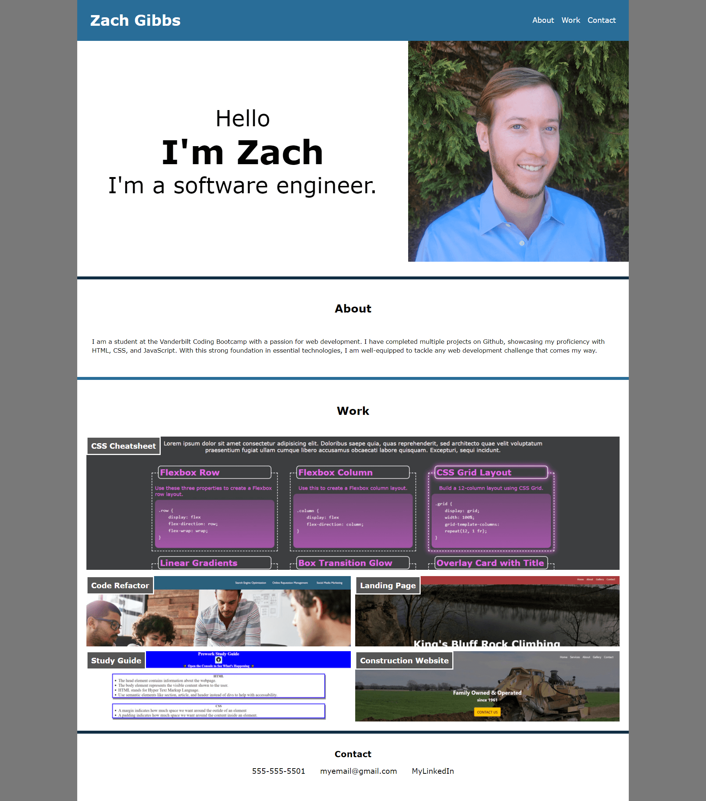

# zacharywgibbs-portfolio

## Description
This a portfolio website showcasing my projects and skills. It has a working navbar that, when clicked, will take you to the section listed. There is an about me, work, and contact section that follows the header.

## Resources

[deployedlink](https://zgibbs58.github.io/zacharywgibbs-portfolio/)

[repositorylink](https://github.com/Zgibbs58/zacharywgibbs-portfolio)

### Screen

